# Find The Dog Memory Game 
Project is deployed [Here](https://tobbe8808.github.io/javascript-p2/) 

Github repository [Here](https://github.com/tobbe8808/javascript-p2/tree/main) 

 This is a memory card game with a dog theme. The game starts with 24 cards all faced down so you don't know what picture is which. 
 You will flip the cards two at a time and try to find the pictures that match if the cards don't match, they flip over again if they do match they stay up. 
 If you pick the right two cards you won't lose any life, but if you pick the wrong cards that doesn't match a life will be taken from you. 
 You have a timeframe of two minutes to finish the game and 8 lives that tick down every time you pick the wrong card. 
 This game is for all ages cause it's a great way to practice your memory. 

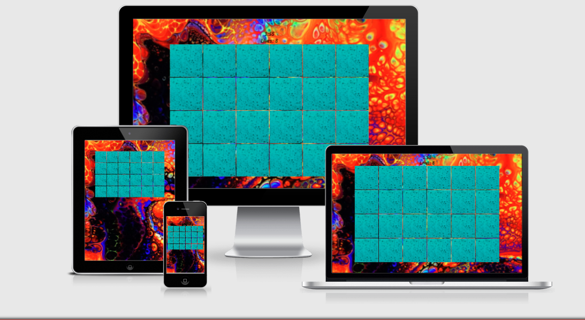 

# Design

For the design I wanted to go for a Psychedelic design around the game and for the background of the cards, also in the text. 
The colors of the text are colorful but also easy to see for someone with visual impairment. 
Font-family used PT Sans for the page. 
## Skeleton 

### **Landing page** 

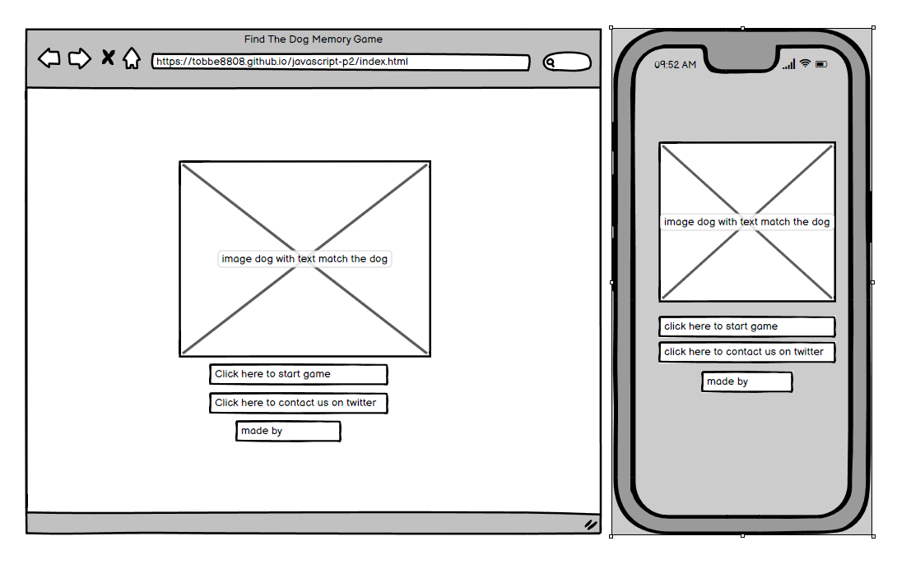 

### **Game page** 

 

## Colors used for text 

### **Click here to start text.** 

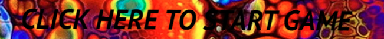

The click here to start text is plain black if you don't hover over it. 
It has a background of rgba(0,0,40,0). And a font size of 3em. 
When you hover over it starts to change colors in many different variations. 

### **Twitter text.**

The twitter background is in Rebeccapurple color. 
The text is Limegreen. 
On hover it turns yellow as in picture below. 
font-size used is xx-large. 

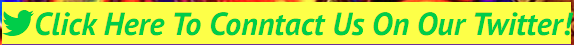 

The text has a fontawesome twitter icon in the start. 

### **Made by tobias text.** 

 

The text has a background color of rebeccapurple. 
The text blinks from black to whitesmoke. 
font-size used is 30px.

### **Timer**

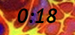 

Timer uses Black color. 
Font-size is 30px. 

### **Lives**

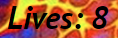 

Lives uses Black color. 
Font-size on Lives is 2em.

## Picture landing page. 

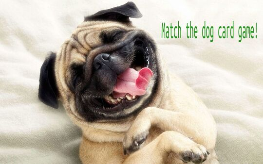

The picture is moving even when not hoverd over but when you hover over it starts moving faster. 
The image is scaled down and i used [Headermaker](https://www.freewebheaders.com/header-maker/) to make the text and crop the picture. 

## Background used. 

 

## Card background used. 

 

# User Experience 

## First time user. 

- For the first time user i want the game to be easy to navigate the Landing page and to get into the game. 
- The user should find the game easy to adapt and learn fast and wanting to stay and play. 
- The user should be able to play the game on multiple screens with diffrent resolutions so he's not forced to use it on his pc or phone. 

## Returning user. 

- The game is 2-3 times Return user friendly, but then the user expects more. 
- I think my game is a bit too simplistic for a returning user. 
- To get returning users the game needs for features so the user can feel that they progress. 
- High score and multiple difficulties is a good start to make the game return user friendly. 

## Owner goals. 

- My goals are to later on update the website with more features. 
- Adding a high score name board, Multiple difficulty levels. 
- These changes should make the website more friendly for returning users. 
- Try to keep the user interested for as long as possible with updates. 

# Features 

## Landing page. 

When you first enter the website you will start at the landing page also called index page. 
On the index page you got a swaying image of a dog with a text that sais Match the dog card game. 
Under the dog image you got the click here to start game which brings you to the game. 
Under the dog image you got the contact us on twitter and the made by tobias text. 
If you hover over the dog image the picture start swaying faster than it did when not hovering. 
The twitter text gets a hover color of lime green. 
The made by Tobias changes text colors blinking. 
The Landing page is made to be simple with some quick info what the game is and click here to play. 

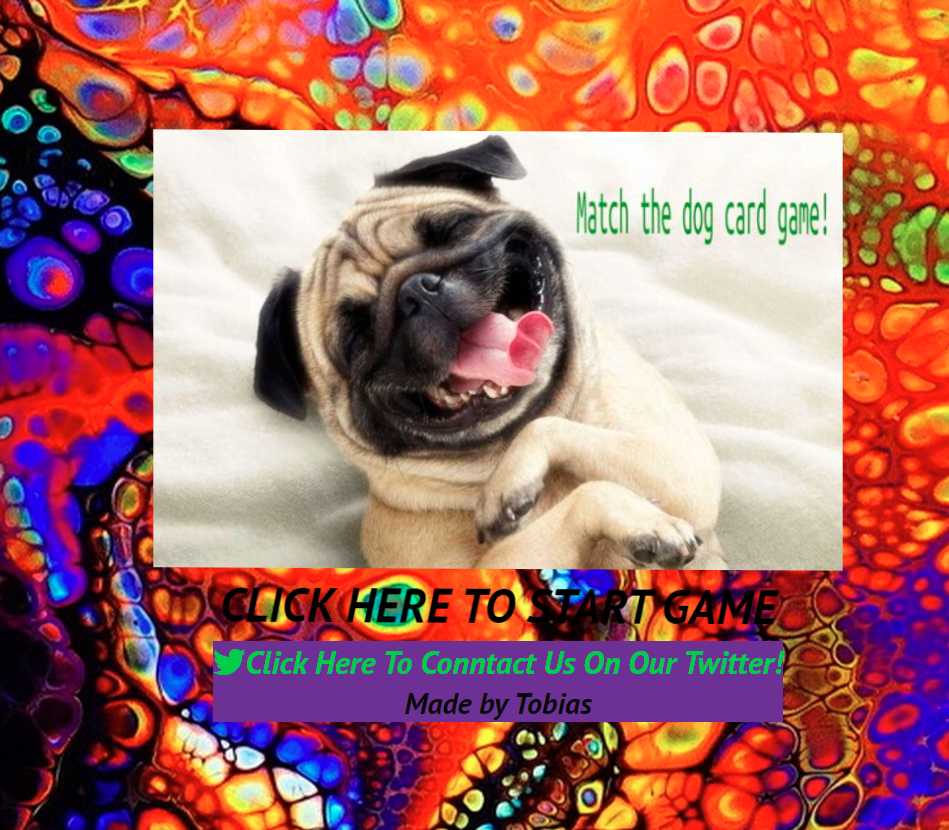

## Game page. 

**Timer** 
The game page when you enter it on the top you see the countdown timer that starts on 2minutes. 
If the counter goes down to 0 you lose the game and get a popup that says you lost the game. 
If you win the game by finding all the right pairs the counter automatically stops counting down and you get a you win popup. 

**Lives** 

The Lives counter is just under the timer counter. 
Every time you pick a wrong pair you lose a life. 
If the lives counter reaches 0 you lose and get a you lost popup. 

**Card board** 

Below the Lives and timer functions you got 4 rows with 6 cards in every row and a total of 24 cards and 12 pairs to find. 

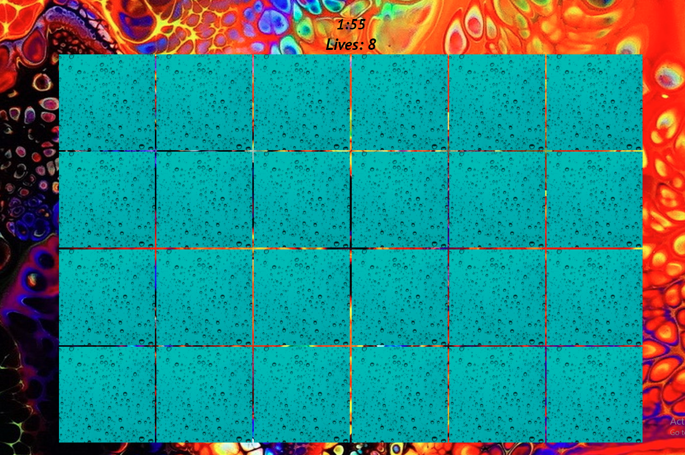 

**Win popup** 
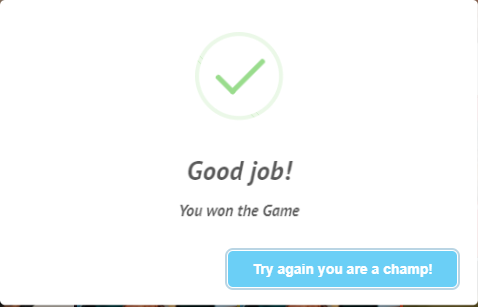 

**lose popup** 
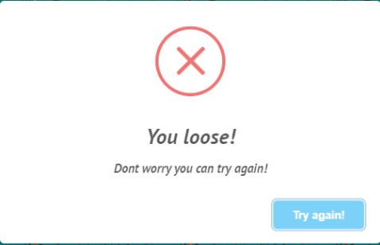 

# Technologies Used

## Coding Languages Used

- HTML 5
- CSS
- Javascript

## Applications Used

- Balsamiq was used to create wireframes.
- Google Fonts were used for the text font.
- Github to upload and store the project.
- Chrome dev tools to test responsiveness test check code.
- Gitpages to upload the site.
- W3 validator to validate css and html code.
- Jshint to validate Javascript code.
- Fontawesome for twitter icon.
- https://www.freewebheaders.com/header-maker/ to make the landing page picture.
- Gitpod To code the website and use git to commit and push code.
- Github pages to upload the website.
- SweetAlert to make a good looking lose/win popup.

# Testing

## Lighthouse

I tested my webpage via lighthouse in the google dev tools. 
I ran google chrome in incognito mode to run the lighthouse tests. 
I ran the Lighthouse checks for Mobile and Desktop. 
At first i had some problems with accessibility score that was just at 70 cause of image ALT code wasn't there, but  after adding that the score  bumped up a lot. 

**Mobile** 
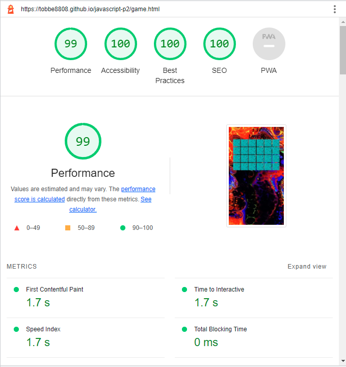

**Desktop** 
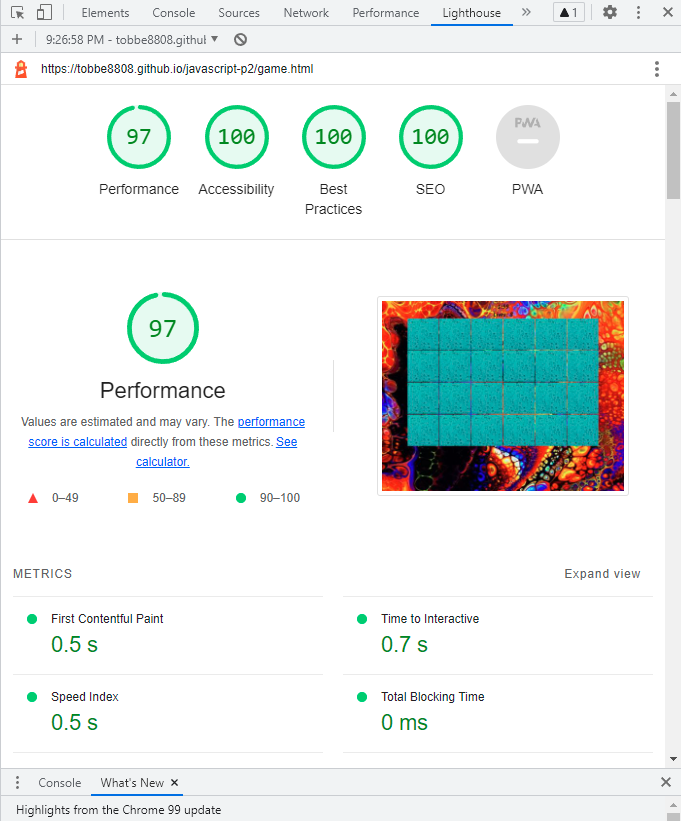

## W3C CSS Validator

I ran the Validator using W3C CSS validator and had one warning for the import of google fonts.
The warnings meaning is that W3C CSS validator is just saying that it won't check the font link so it's not really a problem.

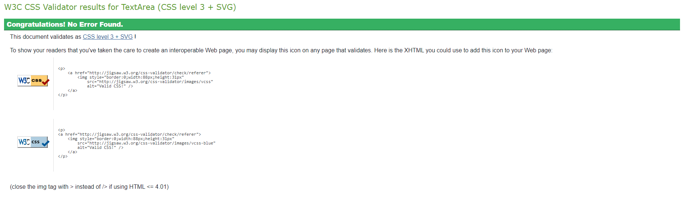

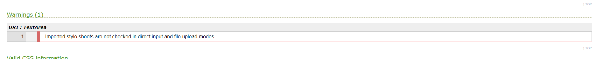

## W3C HTML Validator

I ran the W3C Validator on both the index.html and game.html with no warnings or errors. 

**Index.html**

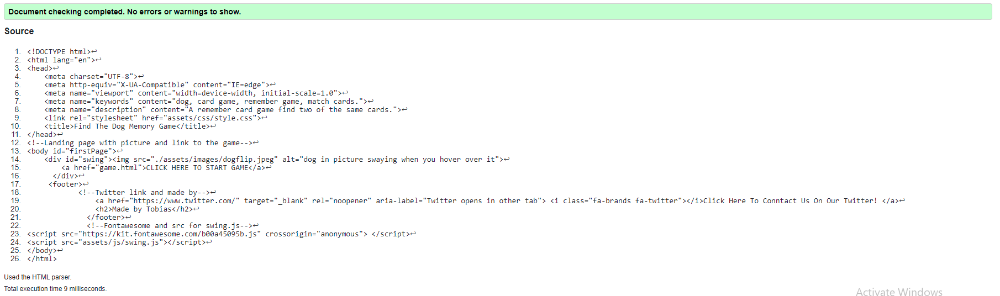
**Game.html**

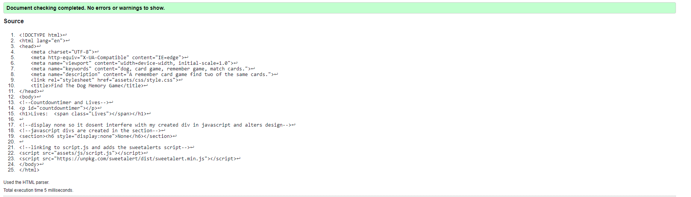

## JSHint Validator

I used JsHint to validate my javascript code using the ES6 feature option for the newer version of the code. 
I validated both the script.js and swing.js. 
The undefined variable swal showing up is from sweetalets cause the validator doesn't recognise those commands. 

**script.js** 
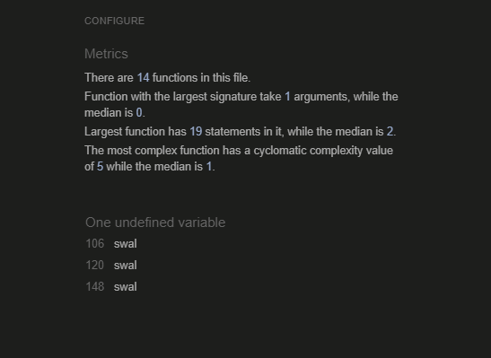

**swing.js** 

## Browser testing 
- Tested in google chrome and site works good. 
- Tested in FireFox and site works good. 
- tested in Opera and site works good. 
- not tested on safari cause i dont own any macs, and i cant run it on pc. 
**I installed firefox and opera on my pc to try the website** 

## Responsive

I coded the website with media queries to be responsive on diffrent resolutions. 
I used google dev tools to test how responsive it was and as reference on how to code it to be responsive. 

The website is responsive on the most used resolutions that i checked via ami.responsivedesign. 

Resolutions 
Desktop 
1600x992px scaled down to scale(0.3181) 
Laptop 
1280x802px scaled down to scale(0.277) 
Tablet 
768x1024px scaled down to scale(0.219) 
Mobile 
320x480px scaled down to scale(0.219) 

I also checked so it works in google dev tools using a few devices. 

It works on all the devices on the picture below. 

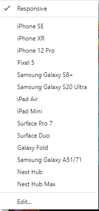 

## Testing functions so they work 

### Landing page 

I did a major test of functions. 
- First I checked so the picture on the landing page was swinging when I was hovering over it and that the text started blinking. 
- I checked so the hover color worked on the twitter link and that the link opens in another tab. 
- I checked so the Made by Tobias was blinking. 
- I checked so that everything was loading background and the picture. 

### Game page 

## Page 
- The background picture loads 
- The card board loads with front and back pictures. 

## Timer 

- First i checked so the timer was starting. 
- Checked so the timer stop on 0 seconds and give us the lose popup. 
- Checked so the timer stops when you win. 
- Checked so the timer restarts after a lose or win when you click try again on the win/lose popup. 

## Lives 

- Checked so the lives counts down when you chose two wrong pictures. 
- Checked so you get a lose popup when you are at 0 lifes. 
- checked so it resets after you lose or win after the popup. 

## flipping cards 

- You can flip more than two cards at a time, but it won't help you cause you still lose life cause I want it to be fast paced. 
- When you find two different pictures the pictures flip back. 
- When you find two of the same cards the cards stay up. 
- When you find all pairs on the board it gives you the win popup. 

## SweetAlerts 

- The sweet alets gives a popup when you run out of time. 
- The sweet alerts gives a popup when you have 0 lives. 
- The sweet alets gives a popup when you find all cards. 
- The game starts over after any alert win or lose. 

## Testing Functions end statement 

All the testing in this steps worked, what I was expecting did happen as I wanted and expected.

## Solved bugs 
### Bug 1 
I had some problems to get my timer to stop counting down when you wont the game. 
At first it had the code  
`if (toggleCard.length === 24) {
        clearInterval(countdowntimer);`
        Targeting my p id. 
I tried many diffrent things and it took awhile. 
I had to change the code `setInterval(updateTimer, 1000);` 
I changed it to `const counter = setInterval(updatetimer, 1000);` 
I had to change it so i could targeted the setinterval and name it. 
After that the timer stopt when i won the game. 
And i used `clearInterval(counter);` and `const counter = setInterval(updatetimer, 1000);` 
to fix it and make counter stop when i won. 

### Bug 2 

I had problems for some time when i tried to upload my page to github pages. 
When i uploaded it didn't wanna show my pictures and after some looking around i understood why.
i wrote my picture patch out like /assets/images github pages doesn't like that. 
Github pages want you to write out the relative paths starting with ../images. 

### Bug 3 

When I did the lighthouse testing i got a score of 70% in accessibility cause my images didn't have any alt tags. 
After looking around a bit for a solution i found one using the code `face.setAttribute("alt", item.name);` 
That code made all the images get an alt tag and the accessibility score went up to high 90s. 

### Unsolved bugs 

None that i know of. 

# Deployment 

## Github pages 

### Upload to Github pages 

1. I started by choosing the Repository that i wanted to upload to github pages. 
2. I choose the main branch since i got a test branch as well. 
3. Then i clicked on settings. 
4. I scrolled down to GitHub Pages and clicked Check it out here. 
5. Then i choose the main Branch and root and then save. 
6. It's now uploaded to Github pages. 

### Test Branch

I did a lot of coding in the test Branch I made so if I did something wrong I wouldn't be a big deal. 
You click on the main branch in Repository and make a new branch and code from that branch. 

### Merging 

After I feelt like I was done in the test branch I merged the test branch into the main branch. 
i did this using git. 
git checkout main 
git merge test 
git add . 
git commit -m "text" 
git push 
And now the test branch code and commits are in the main branch. 

# Credits

## Code taken from
- [Flexbox](https://tipsmake.com/use-the-flexbox-page-layout-in-css)  
- [Stackoverflow](https://stackoverflow.com/)  
- Script and code for the win/lose popup [SweetAlerts](https://sweetalert.js.org/guides/#installation)  
- Countdown timer from DThompsonDev on [Youtube](https://www.youtube.com/watch?v=IOlnFbVLE8s)
- W3schools stop timer [W3schools](https://www.w3schools.com/jsref/met_win_clearinterval.asp)
- Meta tags [Metatags](https://www.searchenginewatch.com/2018/04/04/a-quick-and-easy-guide-to-meta-tags-in-seo/)
- Creating a card game [taniarascia](https://www.taniarascia.com/how-to-create-a-memory-game-super-mario-with-plain-javascript/)
- code for cardgame DEV ED [youtube](https://www.youtube.com/watch?v=-tlb4tv4mC4)
- code for swing.js [codepen](https://codepen.io/nodws/pen/aVBoVp)
- [Code Institute](https://learn.codeinstitute.net/courses/course-v1:CodeInstitute+JSE_PAGPPF+2021_Q2/courseware/30137de05cd847d1a6b6d2c7338c4655/c3bd296fe9d643af86e76e830e1470dd/)
- Slack asking questions and researching to see if someone else had the same problems as me.
- Code institute Tutor help.

## Images
- Font i used was taken from [Google fonts](https://fonts.google.com/)
- All images was taken from [Pexel](https://www.pexels.com/)
- The twitter icon i used was taken from [Fontawesome](https://fontawesome.com/)
- The making of the Landing page dog picture with text [Freewebheaders](https://www.freewebheaders.com/header-maker/)

